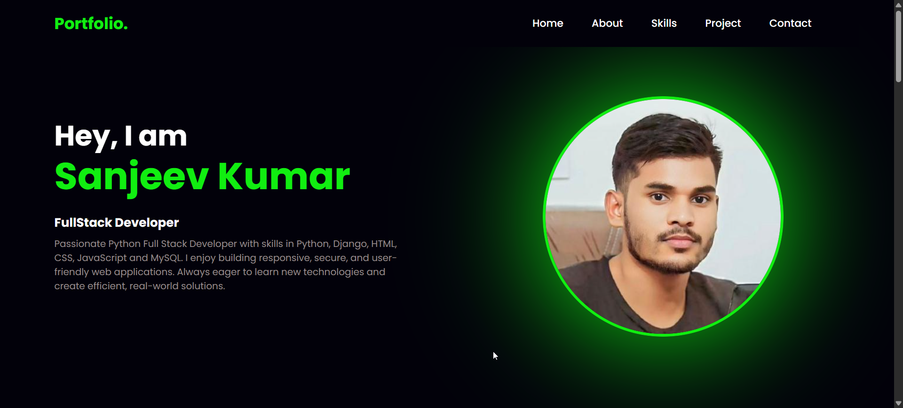

# 💼 Personal Portfolio Website

A modern, responsive personal portfolio website built using HTML, CSS, and JavaScript. This portfolio showcases my skills, projects, and contact information.

## 🚀 Live Demo

🔗 https://your-portfolio-link.netlify.app

### 📸 Preview



## ✨ Features

- Responsive Design
- Modern UI/UX
- Smooth Scrolling
- About Section
- Skills Section
- Projects Showcase
- Resume Download Button
- Contact Form
- Social Media Links
- Clean & Organized Code

## 🛠️ Built With

- HTML5
- CSS3
- JavaScript
- Font Awesome
- Google Fonts

## 📂 Project Structure

```
Portfolio/
│── index.html
│── style.css
│── main.js
│── assets/
│── screenshot/
└── README.md
```

## 📋 Sections

- Home
- About
- Skills
- Projects
- Contact

## 🚀 Getting Started

1. Clone the repository

```bash
git clone https://github.com/Sanjiv888160/Portfolio.git

2. Open the project folder

```bash
cd Portfolio
```

3. Open `index.html` in your browser.

## 📧 Contact

**Sanjeev Kumar**

- 🐙 GitHub: https://github.com/Sanjiv888160

---

⭐ If you like this project, don't forget to give it a **Star** on GitHub!
